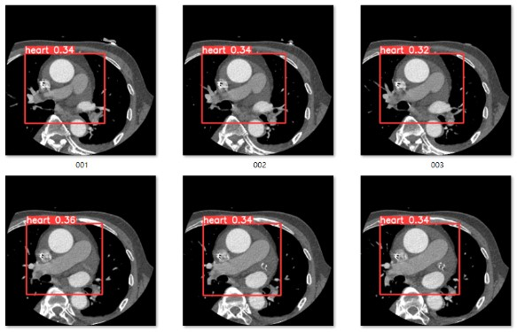
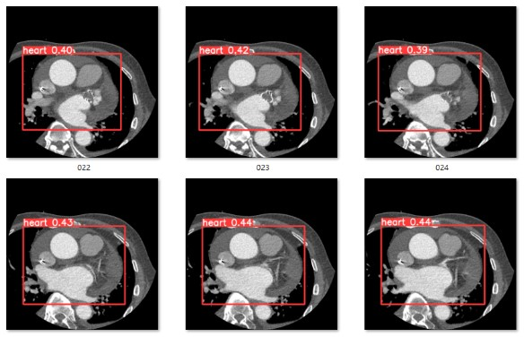

# Stroke Prediction


## 簡介

* 基於 3D-CNN 的 CT 影像分類模型
* 使用 YOLOv5 偵測 CT 影像中心臟的區域
* 在訓練、測試前透過 Uniformizing Techniques 統一輸入影像的大小
* Guided-GradCAM 視覺化模型在 CT 影像中關注區域


## 套件

```
tensorflow
opencv-python
matplotlib
volumentations-3D
pillow
scipy
tqdm
```


## 下載

請下載最新版，將訓練過的權重移至 checkpoints/，資料集解壓至根目錄命名為 dataset

* [Datasets](https://drive.google.com/drive/folders/1-JzW3uJlVD9JAbnb1OOzNJoTU9AFqbVK?usp=share_link)
* [Weights](https://drive.google.com/drive/folders/1p-2f3j27dXx-ZGQwakJ1FI1xxmWi3ox5?usp=share_link)


## 測試

```bash
python predict.py
```


## 評估

|            | Data | Accuracy | Loss |
| ---------- | ---- | -------- | -----|
| Train      | ??   | ??       | ??   |
| Validation | ??   | ??       | ??   |

## 模型訓練

訓練前確認是否有以下資料夾及檔案

```bash
dataset/
├───HIGH/
│   ├───1182214(O)/
│   │       .
│   │       .
│   └───1182214(O)/
│
└───LOW/
    ├───0708758(O)/
    │       .
    │       .
    └───0708758(O)/       
```


## 方法


### YOLOv5 物件偵測

物件偵測使用 [ultralytics/yolov5](https://github.com/ultralytics/yolov5) 來做訓練，框出心臟的位置，排除切片中多餘的器官及黑色區域

<p float="left">
  
</p>
<p float="left">
  
</p>

### 圓心計算

針對方形電表我們使用任三點取圓的方式來獲取圓心，任意三個數值物件的坐標帶入計算即可，而圓型電表則直接使用霍夫變換來偵測圓的外圍

<p float="left">
  
</p>

### 極坐標轉換

使用此方法的好處是可以將有刻度及指針的區域拉成直的，必須要先取得電表中指針的圓心，若圓心坐標誤差太大則會導致我們希望截取的區域過於扭曲

<p float="left">
  
</p>

### 截取 ROI

透過物件偵測中數值物件的坐標，我們可以使用其及坐標轉換後對應的位置，截取出我們感興趣的區域(ROI)，並針對每個 ROI 計算哪一個 Row 的黑色 pixel 最多，則其為指針/刻度的位置

<p float="left">
  
  &emsp;
  
  &emsp;
  
  &emsp;
  
  &emsp;
  
</p>

### 指針數值計算

<p float="left">
  
</p>

## 遭遇問題及困難

* 目前使用的 OCR library(pytesseract) 效果不甚理想，數字辨識錯誤會影響最終的結果
* 對電表中 pattern 處理的演算法彈性不大，仍須對不同型態的電表類別去設計
* 幾乎沒有真實場景中的電表資料，很難估計在光影等因素的影響下成效如何
* 些許情況下無法辨識，如有兩圈刻度的圓形電表，或是其他非常規顯示的電表


## 預計增加功能

* [ ] 將 python 程式碼轉至 Android
* [ ] 使用更精確的數字 OCR library
* [ ] 增加其他類型電表的辨識功能
* [ ] 即時偵測/辨識
* [ ] 輸入影像角度自動校正