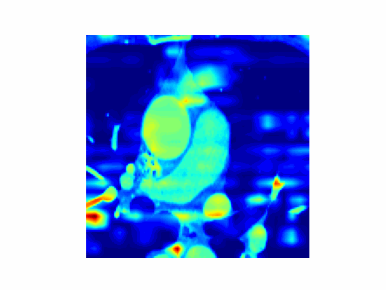
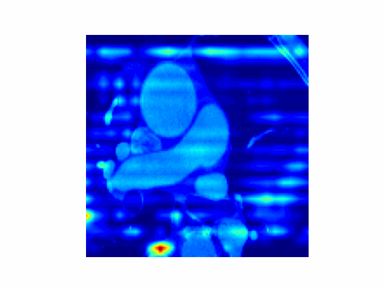

# Stroke Prediction


## 簡介

* 基於 3D-CNN 的 CT 影像分類模型
* 使用 YOLOv5 偵測 CT 影像中心臟的區域
* 在訓練、測試前透過 uniformizing techniques 統一輸入影像的大小
* 3D-Grad-CAM
 視覺化模型在 CT 影像中關注區域


## 套件

```
tensorflow
opencv-python
matplotlib
volumentations-3D
pillow
scipy
tqdm
```


## 下載

請下載最新版，將訓練過的權重移至 checkpoints/，資料集解壓至根目錄命名為 dataset

* [Datasets](https://drive.google.com/drive/folders/1-JzW3uJlVD9JAbnb1OOzNJoTU9AFqbVK?usp=share_link)
* [Weights](https://drive.google.com/drive/folders/1p-2f3j27dXx-ZGQwakJ1FI1xxmWi3ox5?usp=share_link)


## 測試

```bash
python predict.py
```


## 評估

|            | Accuracy | Loss   |
| ---------- | -------- | ------ |
| Train      | 0.9309   | 0.1982 |
| Val        | 0.9701   | 0.1049 |

## 模型訓練

訓練前確認是否有以下資料夾及檔案

```bash
dataset/
├───HIGH/
│   ├───1182214(O)/
│   │       .
│   │       .
│   └───1182214(O)/
│
└───LOW/
    ├───0708758(O)/
    │       .
    │       .
    └───0708758(O)/       
```


## 方法


### YOLOv5 Object Detection

* 物件偵測使用 [ultralytics/yolov5](https://github.com/ultralytics/yolov5) 來做訓練，框出心臟的位置，排除切片中多餘的器官及黑色區域

* 取所有切片中 bounding box 的最左上、最右下座標，作為裁切影像的依據，保證可以框住整顆 3D 心臟

* 此過程將會於 volume data 輸入 3D-CNN 之前的預處理中執行 

* <p float="left">
  
</p>


### Uniformizing Techniques

* 參考 [Uniformizing Techniques to Process CT scans with 3D CNNs for Tuberculosis Prediction](https://arxiv.org/abs/2007.13224) 中提到的 Spline Interpolated Zoom (SIZ)

* 為滿足一致的 input data size，對整個 3D 影像做縮放，沿著 Z 軸尋找附近的像素做插值

* <p float="left">
  
</p>


### 3D-CNN Model

* 使用 Keras 提供的 Conv3D layer 來設計深度學習網路
* 設計 4 層的 3D-CNN 網路，最後由 softmax 輸出 HIGH/LOW 的機率
* 由於訓練資料集較小，採用較不複雜的設計避免 overfitting 

* <p float="left">
  
</p>


### 3D-Grad-CAM


* 3D-Grad-CAM 視覺化 3D-CNN 在心臟斷層掃描中關注的區域
* 將 volume 切成多個 slices 製作成 GIF動畫

* <p float="left">
  
  
</p>

  